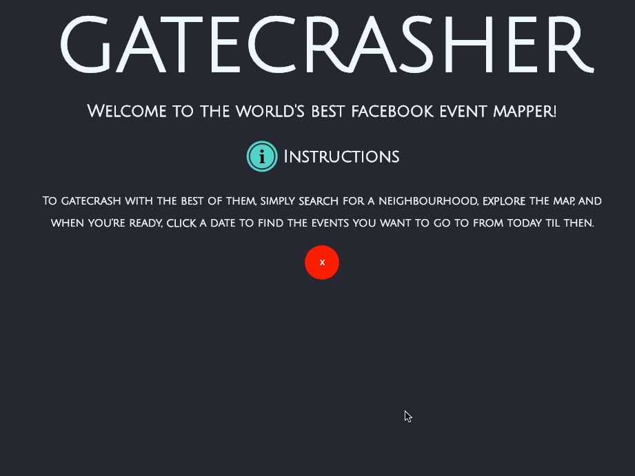

# Gatecrasher
Screencast

Client Quote

"I want to see Facebook events around me thats going on now and to see them without logging on."

Summary

Gatecrasher is a hands on responsive mapping tool that will populate a map with Facebook events within a proximity you choose. Simply set the map viewport with the area you want to search and your page will be populated with all he events in that area by when you choose the date range. Click on areas where there will be multiple events for the map to spider out the multiple results.

Challenge

It is difficult to visualise public Facebook Events on a map and find stuff going on around you, especially without an account.

We would like a solution where you can fund yourself on a map or a pick a location and populate all the events happening there on a certain date.

Solution

The website builds a google map with the markers showing location of events. The radius of search will be made to fit the view port. The user then can click on the marker to find out about the events and get a link to travel to that Facebook page. For markers that overlap on a same location, clicking the marker will open up all the marker with a spiderfying functions to visually see all of them.

Technologies

* Express
* Google Maps API
* Facebook By Location API(graph API)
* Handlebars
* Overlapping Marker Spiderifier

Minesh Shah | Max Gerber | Aseel Mustafa (in spirit?)

URL

The project can be found at: https://gatecrasher.herokuapp.com/
