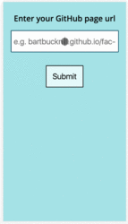

# [prereqCheck](https://prereq-check.herokuapp.com): Case studies :books: :heavy_check_mark: :toilet: :frowning:

## Screencast

A screencast of prereqCheck can be found below.

## Client Quote

"I really love what you guys have done."

"I love it."

"This is great and will be so useful."

"I can't wait to use it."

"When will it be deployed?"

*Dan Sofer, Founder of Founders & Coders*

## Summary

prereqCheck is an application targeted at both FAC applicants and selection committee members. It allows the user to see at a glance whether an applicant has completed the [pre-requisites for FAC application](https://foundersandcoders.com/apply/prerequisites/). It provides useful links and extra information for the assessment of the quality of completed prerequisites.

## Challenge

Previously selection committee members did not have a clear interface summarising an applicant's preqrequisite completion status. Gathering this information was a laborious process of going to multiple sources.

## Solution

We built preReqCheck as a mobile-first application with responsive design so that it can be used on-the-go by applicants and on desktop for the selection committee when going through all applications.

Our focus was that prereqCheck should be a one-stop-shop where an applicant's progress on all the prequisites can be viewed in one place.

The user flow is easy for applicants: after signing in with GitHub, they can enter their GitHub Pages site url and then receive information on their current progress in the various prerequisites. For the selection committee the flow is even easier: they receive a direct link to the summary page for each applicant.

## Tech

We implemented the following technologies to accomplish this:

JavaScript
SCSS
Handlebars
Node.js
Express.js

We placed a high emphasis on code quality and test coverage, which at the time of writing stands at 92%.

[**B**art Bucknill](https://github.com/BartBucknill) | [**A**stro Aisha](https://github.com/astroash) | [**A**mélie Chan](https://github.com/ameliejyc) | [**D**akshina Scott](https://github.com/dangerdak)

## URL

The project repo can be found at:
https://github.com/ameliejyc/prereq-check

# :deciduous_tree: :cow2: :cow2::cow2: :cow2::cow2: :cow2: :cow2: :hankey:
